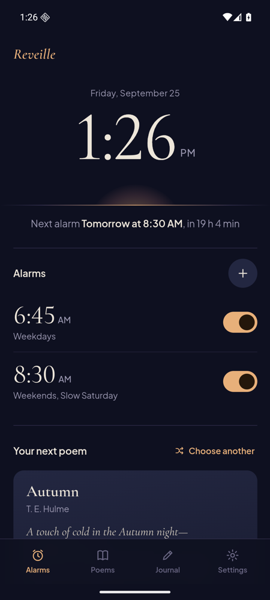
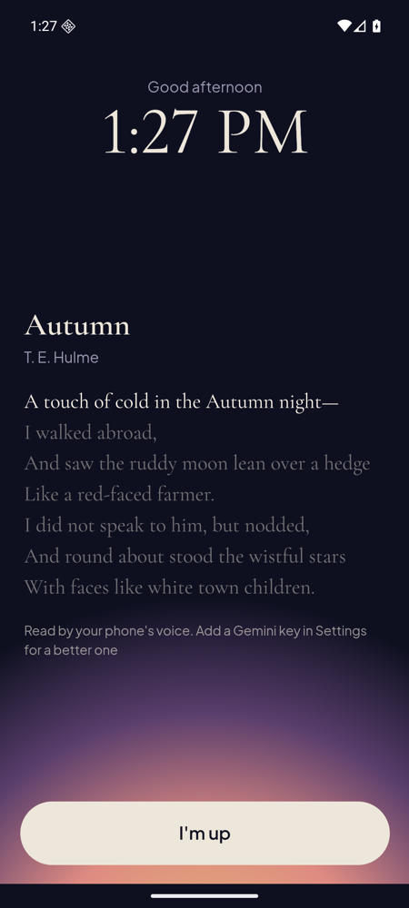
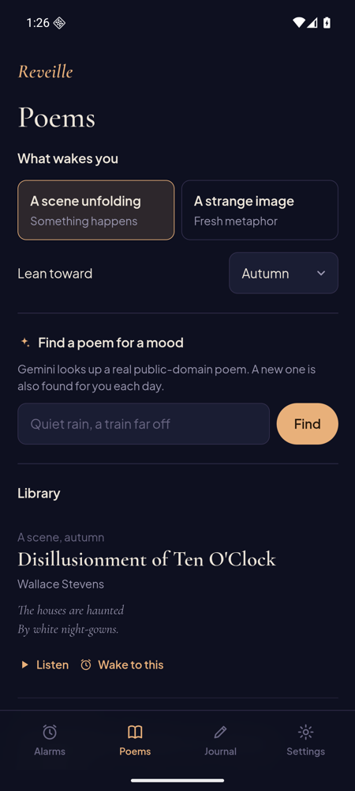

# Reveille

**An alarm clock that wakes you with a poem read aloud.**

Instead of a beeping alarm, Reveille reads you a short public-domain poem while the screen brightens like a sunrise. The poems are chosen for mornings: a scene unfolds, the imagery is fresh, and the ending is left open, so you wake up with something to think about. Add a free Google Gemini key and a natural voice reads to you, with a new poem found for you every day.

<p align="center">
  
  
  
</p>

## Get it

| | |
|---|---|
| **Android** | [Download the app](https://github.com/VincentKovar/reveille/releases/latest/download/Reveille.apk), then follow the **[Android install guide](docs/INSTALL-ANDROID.md)**. Rings even when your phone is locked. |
| **iPhone** | Open **[vincentkovar.github.io/reveille](https://vincentkovar.github.io/reveille/)** in Safari and add it to your Home Screen. See the **[iPhone guide](docs/INSTALL-IPHONE.md)**. Rings while open on your nightstand. |

It's free, with no account, no ads, and no tracking. You bring your own (free) Gemini API key, or use your phone's built-in voice with no key at all.

## What it does

- **Multiple alarms** with repeat days (weekdays, weekends, any combination, or once).
- **Poem read aloud** by one of 12 Gemini voices, with a delivery style you describe in plain words ("slowly, like waking a friend at sunrise"), or by your phone's own voice.
- **A fresh poem daily**, looked up by Gemini, or pick one for a mood: *"first snow, empty street."* A 30-day history keeps poems from repeating.
- **Fail-safe wake-up:** the voice fades in gently, and if it can't start (or you drift back to sleep after the poem), a bell chime starts and climbs to full volume until you tap *I'm up*.
- **Works offline:** your next poem is recorded ahead of time, and all fonts and code are bundled with the app.
- **Morning journal** that opens right after you wake, prompted by the poem you just heard.
- **Guided setup** that walks new users through the API key, first alarm, and permissions.

## How it works

Reveille is one web app (plain HTML, CSS, and JavaScript, no framework and no build step) that ships two ways:

```
www/                      the whole app, shared by both platforms
  js/schedule.js          alarm maths (unit-tested)
  js/platform.js          one interface, two implementations ↓
  js/gemini.js            poem lookup + text-to-speech
android/                  Capacitor wrapper + native alarm engine (Java)
  AlarmScheduler.java     books the next ring with AlarmManager.setAlarmClock
  AlarmService.java       lock-screen alarm, wake lock, plays the poem
  AlarmAudio.java         alarm-channel audio, fade-in, fail-safe chime
  ReveilleAlarmPlugin.java  the bridge called from platform.js
```

- **On Android**, alarms are booked with `AlarmManager.setAlarmClock`, the same mechanism as the built-in Clock app. They fire on time through Doze, after the app is closed, and after a reboot. At ring time a foreground service turns the screen on over the lock screen and plays the pre-recorded poem itself, on the **alarm** audio stream, before the web layer has even loaded. The fail-safe chime is native too, so it doesn't depend on the WebView.
- **In a browser or on iPhone**, alarms are checked by a timer while the app is open, audio goes through Web Audio (so the volume can fade in on iOS), and a Wake Lock keeps the screen on in nightstand mode. Web apps can't wake a locked phone; Reveille says so plainly instead of pretending otherwise.
- **Gemini** is called straight from the device with the person's own key, which never touches a server of mine. The code uses Google's current Interactions API and falls back to the older `generateContent` API, so a Google-side API change doesn't break it.

## Build it yourself

**Web version:** no build step.
```bash
npm run dev          # serves www/ at http://localhost:8125
npm test             # schedule logic tests
```

**Android app:** needs JDK 21 and the Android SDK (platform 36).
```bash
npm install
npm run build:android    # both editions → release/
```
Without a signing key configured, APKs are signed with the debug key. That's fine for personal use. To sign releases, see [docs/PERSONAL-EDITION.md](docs/PERSONAL-EDITION.md).

**Don't want to install anything?** Fork this repo. The **Build Android app** GitHub Action builds an installable APK for you on every push (Actions tab → latest run → *Artifacts*).

**Making your own version:** change `appId` in `capacitor.config.json` and `applicationId`/`namespace` in `android/app/build.gradle`, and your name in `www/js/config.js`.

## Poems and credits

The built-in poems are in the public domain in the United States. Poems found by Gemini are looked up by an AI, so check their wording against a trusted source before quoting them.

Typefaces: [Cormorant Garamond](https://github.com/CatharsisFonts/Cormorant) and [Plus Jakarta Sans](https://github.com/tokotype/PlusJakartaSans), both under the SIL Open Font License.

Designed and built by **Vincent Kovar**. Released under the [MIT License](LICENSE): fork it, remix it, make it yours.
